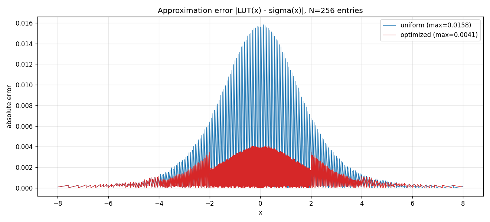
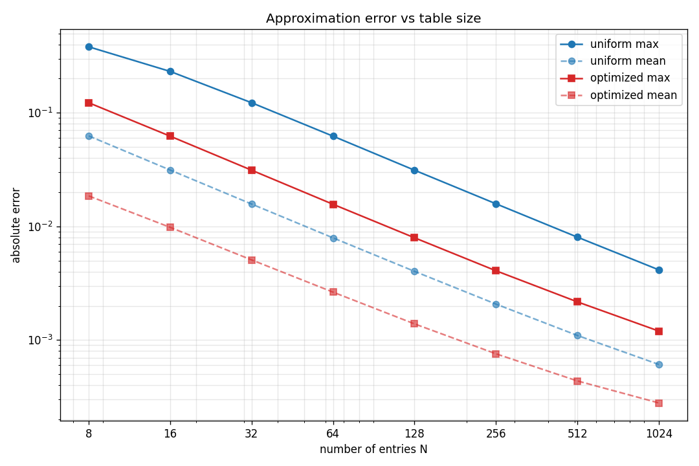

# Hardware Sigmoid Approximation with Look-Up Tables

A SystemVerilog implementation of the sigmoid activation function
σ(x) = 1 / (1 + e⁻ˣ) for hardware neural networks, using pre-computed
Look-Up Tables (LUTs). The project delivers **two architectures** — a
straightforward uniform LUT and an optimized variant exploiting symmetry and
non-uniform segmentation — together with a layered, constrained-random
testbench that verifies both, and a Python analysis that quantifies the
accuracy/cost trade-off.

---

## 1. Goal

Sigmoid is a key building block of neural networks, but evaluating
`1/(1+e⁻ˣ)` directly in hardware is expensive (it needs a divider and an
exponential). The standard solution is to pre-compute the function offline and
store the samples in a small ROM, turning evaluation into a single memory
read. This project explores how to do that accurately while keeping the
hardware cheap, and how much accuracy a smarter table layout buys at the same
memory cost.

All arithmetic uses **fixed-point Q4.12** on 16-bit words:

* input `x_in` — signed Q4.12, range `[-8.0, +7.9997]`
* output `y_out` — Q4.12, range `(0, 1)`
* real value = `raw_integer / 4096`

---

## 2. Architecture A — uniform LUT (`src/sigmoid_lut.sv`)

256 samples of σ(x) are stored for evenly spaced points across the full input
range `[-8, +8)` (step `16/256 = 0.0625`). The table is generated by
`scripts/gen_lut.py` and loaded with `$readmemh`.

**Address mapping.** The ROM index is obtained directly from the input bits:

```
addr = x_in[15:8] ^ 8'h80
```

* taking the top 8 bits is an integer divide by `2⁸`, mapping the input onto
  256 cells of width `0.0625`;
* XOR-ing the sign bit converts two's-complement to *offset binary*, so that
  `x = -8 → addr 0`, `x = 0 → addr 128`, `x = +7.9997 → addr 255`.

Because exactly 8 bits are extracted, every possible 16-bit input maps
**bijectively** onto a valid address `0…255`. The index can never overflow the
table, so **no clamping logic is required** — a deliberate simplification (the
original spec listed clamping as a requirement; the chosen mapping makes it
unnecessary).

The output is registered, giving a **1-cycle latency**.

---

## 3. Architecture B — optimized LUT (`src/sigmoid_lut_optimized.sv`)

The optimized module spends the same 256 entries far more effectively, using
two independent ideas.

### 3.1 Symmetry

Sigmoid obeys `σ(-x) = 1 - σ(x)`. Only the **left half** (`x ≤ 0`) is stored;
the right half is reconstructed on the fly:

```
x < 0 :  y = ROM[addr]
x > 0 :  y = 1 - ROM[addr]      (with the input folded to |x|)
x = 0 :  y = 0.5                (the symmetry axis, handled explicitly)
```

This alone **doubles the effective density** for the same ROM size.

### 3.2 Non-uniform segmentation

A uniform grid wastes resolution: sigmoid is steep near 0 and almost flat in
the tails, yet a uniform table samples both equally. The optimized table splits
the stored half into **three segments of increasing density toward zero**:

| segment | range of \|x\| | entries | step    |
|---------|----------------|---------|---------|
| seg0    | [4, 8)         | 64      | 2⁻⁴ = 0.0625    |
| seg1    | [2, 4)         | 64      | 2⁻⁵ = 0.03125   |
| seg2    | [0, 2)         | 128     | 2⁻⁶ = 0.015625  |

The segment boundaries (2, 4, 8) and the steps (2⁻⁴, 2⁻⁵, 2⁻⁶) are all powers
of two **by design** — this is what keeps the addressing cheap in hardware:
segment selection is a look at the top magnitude bits, and the in-segment index
is a subtract-and-shift:

```
|x| ∈ [4,8) :  addr =       (xn + 0x8000) >> 8
|x| ∈ [2,4) :  addr = 64  + (xn + 0x4000) >> 7
|x| ∈ [0,2) :  addr = 128 + (xn + 0x2000) >> 6
```

where `xn` is the input folded to its negative magnitude. Arbitrary
(non-power-of-two) node placement would force a stored breakpoint table and a
comparator/binary-search tree, destroying the O(1) addressing — power-of-two
segmentation is the practical compromise.

Latency is again **1 cycle**.

---

## 4. Verification (`sim/`)

Both modules are verified by a single **layered, UVM-style testbench** built
from reusable components communicating through a virtual interface:

```
generator → (mailbox) → driver → DUT → monitor → scoreboard / coverage
```

* **`sigmoid` transaction** — randomized `x_in`, with a real-valued reference
  model (the golden σ) computed in `post_randomize`.
* **generator / driver / monitor** — produce, apply and observe transactions;
  a clocking block samples the registered output on the stable clock edge and
  the input observation is delayed to match the DUT's 1-cycle latency.
* **scoreboard** — a FIFO of expected transactions matched in order against the
  monitored outputs, with a configurable tolerance and running max/mean error
  statistics.
* **coverage** — a covergroup over the ROM address records which of the 256
  table entries were actually exercised.

Three stimulus classes drive the same infrastructure:

* **`edge_case_sigmoid`** — directed corner cases (0, ±8, ±4) via a `randc`
  index, exact comparison.
* **`discrete_sigmoid`** — constrained-random points that land exactly on the
  uniform grid, used as a bit-exact datapath check.
* **general** (base transaction) — fully random `x_in` compared against the
  *true* sigmoid with a tolerance covering the quantization plus
  piecewise-constant step error.

The same reference model (true σ) is DUT-independent, so one testbench checks
**both** architectures by pointing the environment at each DUT's output
interface. Both modules pass at 100 %.

A useful cross-check: the simulated errors match the Python models below to
within a few percent (e.g. optimized max error 0.00391 in simulation vs 0.00407
in the model), confirming that the RTL behaves exactly as designed.

---

## 5. Results

The Python models in `scripts/compare_models.py` replicate the RTL faithfully
(floor quantization, the 1-σ fold, the exact segment/address arithmetic) and
sweep the table size for both architectures.

### Error vs input (N = 256)



The uniform error peaks at ≈0.0158 around x = 0 — exactly where sigmoid is
steepest. The optimized error peaks at ≈0.0041 and is visibly **symmetric**
(symmetry exploitation) with **discontinuities at |x| = 2 and 4** where the
sampling density changes (segmentation).

### Error vs table size



| N | uniform max | uniform mean | optimized max | optimized mean | max improvement |
|---|---|---|---|---|---|
| 8 | 0.38085 | 0.06256 | 0.12255 | 0.01855 | 3.11x |
| 16 | 0.23119 | 0.03134 | 0.06225 | 0.00981 | 3.71x |
| 32 | 0.12255 | 0.01573 | 0.03124 | 0.00507 | 3.92x |
| 64 | 0.06225 | 0.00793 | 0.01566 | 0.00264 | 3.98x |
| 128 | 0.03124 | 0.00402 | 0.00794 | 0.00139 | 3.93x |
| 256 | 0.01582 | 0.00207 | 0.00407 | 0.00076 | 3.89x |
| 512 | 0.00805 | 0.00110 | 0.00217 | 0.00044 | 3.71x |
| 1024 | 0.00415 | 0.00061 | 0.00120 | 0.00028 | 3.46x |

Both curves fall as ≈1/N (the expected behaviour of a piecewise-constant
approximation), but the optimized variant sits a roughly **constant ~4× below**
the uniform one across the practical range. The gain erodes slightly at the
extremes: at N = 8 the segment proportions are too coarse to help fully, and at
N = 1024 the uniform table is already accurate while the optimized maximum
migrates into the coarse `[4,8)` tail.

---

## 6. Cost / trade-off

| | uniform | optimized |
|---|---|---|
| ROM size | 256 × 16 bit | 256 × 16 bit (identical) |
| Latency | 1 cycle | 1 cycle (identical) |
| Address logic | bit-slice + XOR | negate + segment select (`casez`) + add/shift |
| Output logic | direct read | direct read **or** `1 - ROM[addr]` fold |
| Max error (N=256) | 0.0158 | 0.0041 |

The headline result: **for the same memory and the same latency, a modest
amount of extra combinational logic buys ~4× accuracy.** The 4× factor is the
product of the two techniques — ≈2× from symmetry (half the table, mirrored)
and ≈2× from concentrating samples where the curve is steep.

---

## 7. How to run

```bash
make lut     # generate both .hex tables (Python, in a venv)
make sim     # compile, elaborate and simulate both DUTs (Vivado xvlog/xelab/xsim)
make plots   # regenerate the comparison figures in img/
make clean   # remove simulation artifacts
```

`make environment` enters the distrobox container that hosts Vivado.

### Repository layout

```
src/   sigmoid_lut.sv            uniform LUT module
       sigmoid_lut_optimized.sv  symmetry + segmented module
sim/   top.sv, test.sv, environment.sv, generator.sv, driver.sv,
       monitor.sv, scoreboard.sv, coverage.sv, sigmoid.sv, fixed_point_if.sv
scripts/ gen_lut.py, gen_optimized_lut.py, compare_models.py
img/   compare_error.png, error_vs_size.png
```

---

## 8. Conclusions and further work

* A uniform LUT is trivial to address (single bit-slice, no clamping) and its
  error scales as 1/N, peaking where sigmoid is steepest.
* Exploiting symmetry and power-of-two segmentation improves accuracy ~4× at
  identical memory and latency, at the price of a little address-generation
  logic — a favourable trade for an activation function.
* The natural next step is **linear interpolation** between table entries,
  whose error scales as 1/N² rather than 1/N, offering a far steeper
  accuracy-per-entry curve at the cost of one multiplier and a deeper pipeline.
